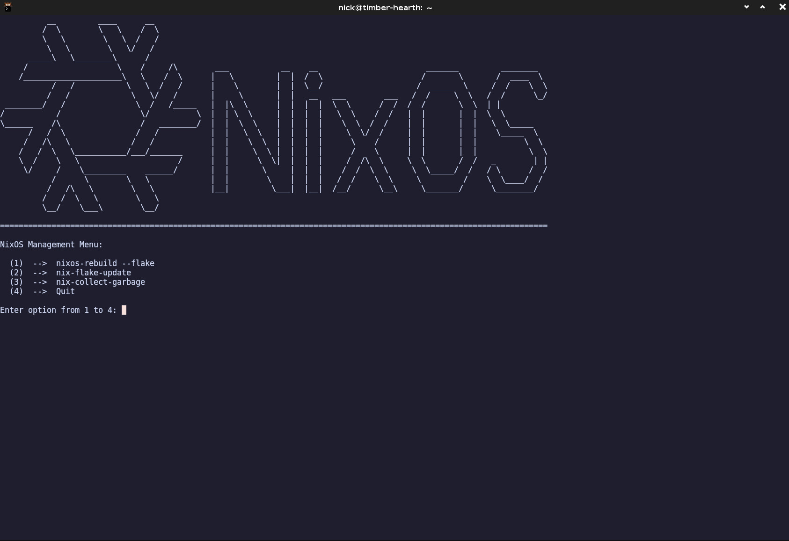

# NixOS Management Menu

                    __    
              /\    \ \  /\
              \ \    \ \/ /
            ___\ \____\  /   /\     ___     _                 ___     ____
           /___________\ \  / /    |   \   | |               / _ \   / __ \
               / /      \ \/ /____ | |\ \  | | ( )          / / \ \ / /  \/
         _____/ /        \/ _____/ | | \ \ | |  _  __    __ | | | | \ \___
        /____/ /\        / /       | |  \ \| | | | \ \  / / | | | |  \___ \
            / /\ \______/_/____    | |   \   | | |  \ \/ /  | | | |      \ \
           / /  \ \_____  ____/    | |    \  | | |  / /\ \  \ \_/ / /\___/ /
           \/   /  \    \ \        |_|     \_| |_| /_/  \_\  \___/  \_____/
               / /\ \    \ \
               \/  \_\    \/       ==========================================

## WHAT DOES IT DO?

- Terminal User Interace for interacting with NixOS
    - Written in C++
    - Takes a numberical user input to perform an action
    - Automates some NixOS system management commands
    - Small project to learn C++

- Current actions that can be performed:
    - nixos-rebuild switch --flake /path-to-config#host
    - nix-flake-update
    - nix-collect-garbage
    - quit

- Future Plans:
    - Add options for setting up development environments
    - Rollback to previous NixOS configurations
    - Try developing with a GUI instead of a TUI

## SCREENSHOT

